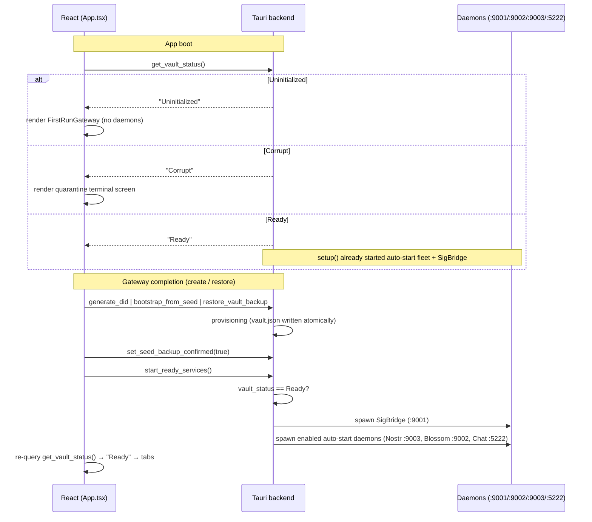

# RFC-001 — First-Run Gateway & Vault Lifecycle State Machine

**RFC ID:** `RFC-001`
**Title:** First-Run Gateway & Vault Lifecycle State Machine
**Author:** iyou_home engineering
**Target Release:** `v0.2.1+`
**Status:** Implemented (`commit ff746a0`) — Living Specification
**License Header:** GPL-3.0-or-later — Copyright (C) 2026 David Byers dba Byers Brands

---

## 1. Problem Statement

Greenfield `iyou_home` installs (first launch on a fresh secondary device such
as a Debian laptop or a restored macOS machine) previously bootstrapped a new
root seed **silently** the first time any vault-touching code path ran. That
silent bootstrap produced a cascade of identity-safety failures:

1. **Identity fragmentation across devices.** A user who authenticates on a
   Mac, then installs on Debian, receives a *brand-new* root seed — a new
   Anchor (L0) and new Primary (L1) — with no warning and no path to the
   identity they established on the first device.
2. **L0 exposed prematurely.** The Level 0 Anchor (the air-gapped root
   identity, `is_system_reserved: true`) was created by accident of
   first-use, meaning the most sensitive tier of the hierarchy could exist
   without the user ever consenting to its creation or recording its seed.
3. **L1 left unpopulated.** Legacy single-profile vaults (pre-hierarchy) left
   the Level 1 Public Persona missing, breaking every downstream consumer that
   resolves "the active persona" (`public_persona()`, JID binding, Nostr
   pubkey derivation, bridge summaries).
4. **Daemons binding to nothing.** The local Signature Bridge (`:9001`), Nostr
   relay (`:9003`), Blossom (`:9002`), and XMPP (`:5222`) could start *before*
   an active Level 1 key existed, so relay identity binding and relay-mesh
   publication pointed at an empty or wrong persona.

This RFC defines the **vault lifecycle state machine** and the **first-run
gateway** that make silent bootstrapping impossible, and the **daemon startup
hooks** that defer every background service until the vault is provably
`Ready`.

---

## 2. Goals / Non-Goals

### 2.1 Goals

- **Explicit choice, always:** a greenfield vault can only be created or
  restored through the first-run gateway; no code path silently creates one.
- **Four observable states:** `Uninitialized`, `Provisioning`, `Ready`,
  `Quarantined` — with exactly one legal transition for each edge.
- **Mandatory cold-seed ceremony:** creation mints L0+L1 atomically, then
  blocks main-navigation until the user proves the recovery seed was recorded
  (chunk challenge or typed acknowledgment).
- **Deterministic restore:** a 32-byte root seed (hex or base58) re-derives a
  byte-identical vault (same DIDs) on any device.
- **Daemon dormancy:** no relay, bridge, or background daemon binds before
  `Ready`.

### 2.2 Non-Goals

- Custodial/recovery policies for children (see RFC-005).
- Self-hosted satellite admin tooling (see RFC-003).
- Multiple independent vaults per device (single-vault model retained).

---

## 3. Terminology

| Term | Meaning |
|:---|:---|
| **Vault** | `vault.json` — a base64 envelope of the `VaultStore` JSON (see §8). |
| **L0 Anchor** | Derivation Index 0, `profile_id: "anchor"`, `level: 0`, system-reserved, air-gapped. |
| **L1 Primary** | Derivation Index 1, `profile_id: "primary"`, `level: 1`, default active persona. |
| **Seed ceremony** | The mandatory "write down your recovery seed" proof (chunk challenge or typed ack). |
| **Gateway** | The full-screen `FirstRunGateway` component rendered while the vault is not `Ready`. |
| **SigBridge** | The local WebSocket signature bridge (`wss://home.iyou.me:9001`). |

---

## 4. Vault State Machine

### 4.1 Canonical Four-State Machine

```
                          ┌────────────────────────────┐
                          │       Uninitialized        │
                          │  (no vault.json on disk)   │
                          └──────────────┬─────────────┘
                                         │
            create (generate_did)        │        restore (bootstrap_from_seed /
            restore backup               │        restore_vault_backup)
                                         ▼
                          ┌────────────────────────────┐
                          │        Provisioning        │
                          │  vault persists on disk    │
                          │  seed ceremony incomplete  │
                          └──────────────┬─────────────┘
                                         │
            ceremony complete            │        Import failure /
            (set_seed_backup_confirmed=  │        parse error (fail-closed, no
             true; gateway onInitialized)│        state change)
                                         ▼
                          ┌────────────────────────────┐
                          │           Ready            │
                          │  vault valid + loaded +    │
                          │  seed_backup_confirmed     │
                          └──────────────┬─────────────┘
                                         │
            load / parse failure         │        (quarantine: rename to
            (VaultLoadError::Corrupt /   │         vault.json.corrupt_<ts>.bak)
             Io)                         ▼
                          ┌────────────────────────────┐
                          │        Quarantined         │
                          │  damaged file moved aside; │
                          │  NEVER auto-healed         │
                          └────────────────────────────┘
```

### 4.2 Legal Transitions

| From | To | Trigger | Guard (fail-closed) |
|:---|:---|:---|:---|
| `Uninitialized` | `Provisioning` | `generate_did` / `bootstrap_from_seed` / `restore_vault_backup` | `bootstrap_vault_from_seed_at_path` refuses if `vault.json` exists; vault written atomically (`.tmp` + `sync_all`). |
| `Provisioning` | `Ready` | `set_seed_backup_confirmed(true)` + `onInitialized` → `start_ready_services` | Ceremony proof must pass first (`isCeremonyValid`). |
| `Ready` | `Provisioning` | (reload) `VaultStatus::Ready` but `seed_backup_confirmed == false` | Legacy `FirstRunSeedGate` overlay as recovery path. |
| `Ready` / `Provisioning` | `Quarantined` | `load_vault_from_path` fails (base64/JSON/schema) | File renamed to `vault.json.corrupt_<UNIX>.bak`; 5 rotated backups retained. |
| `Quarantined` | any | **FORBIDDEN** | Terminal warning screen; user restores from backup/seed on a fresh install. |

### 4.3 Wire Enum vs. Canonical States

The canonical machine uses four states. The `VaultStatus` enum currently
serialized over IPC is a three-value projection; `Provisioning` is derived by
combining IPC status with the persisted `seed_backup_confirmed` preference:

| Canonical state | `get_vault_status` IPC | `preferences.seed_backup_confirmed` | Frontend surface |
|:---|:---|:---|:---|
| `Uninitialized` | `"Uninitialized"` | n/a | Gateway landing |
| `Provisioning` | `"Ready"` (vault valid) | `false` | Gateway ceremony (mounted via `gatewayActive`), or legacy `FirstRunSeedGate` on reload |
| `Ready` | `"Ready"` | `true` | Main tabs |
| `Quarantined` | `"Corrupt"` | n/a | Terminal warning screen |

> **RFC decision (v0.3, wire-breaking):** rename the wire value `"Corrupt"` to
> `"Quarantined"` in `VaultStatus` with a one-release serde alias, so the wire
> mirrors the canonical machine exactly. No frontend-visible behavior changes.

```rust
// src-tauri/src/vault.rs — current projection (v0.2.1)
#[derive(Debug, Clone, Copy, PartialEq, Eq, serde::Serialize)]
#[serde(rename_all = "PascalCase")]
pub enum VaultStatus {
    Uninitialized, // greenfield — gateway must run
    Ready,         // valid vault loads cleanly
    Corrupt,       // damaged → quarantined; never regenerate
}
```

---

## 5. First-Run Gateway UI

### 5.1 Render Rules (`src/App.tsx`)

- `vaultStatus === null` → boot splash (`Initializing sovereign enclave…`).
- `vaultStatus === "Uninitialized" || gatewayActive` →
  `<FirstRunGateway onInitialized={handleInitialized} />`.
  - `gatewayActive` stays `true` across the ceremony so the gateway never
    unmounts mid-ceremony (the vault flips to `Ready`-on-disk at `generate_did`,
    *before* the seed ceremony completes).
- `vaultStatus === "Corrupt"` → terminal warning screen (see §5.5).
- Otherwise → main tabs.

### 5.2 Landing Mock (step `landing`)

```
┌──────────────────────────────────────────────────────────────┐
│  🛡️ Sovereign Onboarding                                     │
│  iyou_home is a self-sovereign identity enclave. Your         │
│  identity lives only on this device until you back it up.     │
│  Choose how to begin.                                         │
│                                                               │
│  ┌────────────────────────────────────────────────────────┐  │
│  │ ✦ Create Sovereign Identity                           │  │
│  └────────────────────────────────────────────────────────┘  │
│  Mints your Anchor (L0) and Primary (L1) identities from a   │
│  fresh root seed, then walks you through writing it down.    │
│                                                               │
│  ┌────────────────────────────────────────────────────────┐  │
│  │ ⟲ Sync / Restore Existing Device                       │  │
│  └────────────────────────────────────────────────────────┘  │
│  Recover an existing identity from an encrypted              │
│  .iyoubackup archive or a master seed phrase.                 │
└──────────────────────────────────────────────────────────────┘
```

### 5.3 Create Flow (atomic L0+L1, then mandatory seed ceremony)

1. `handleCreate()` → `invoke("generate_did")`.
   - Backend mints from a fresh OS-random 32-byte seed: L0 Anchor (index 0)
     + L1 Primary (index 1, `active: true`), writes `vault.json` atomically,
     sets `state.active_did` to the Primary DID, returns the DID.
2. `invoke("reveal_master_seed")` returns the 64-char hex seed → rendered as
   16 chunks of 4 hex chars each.
3. Ceremony (step `seed-ceremony`), two interchangeable modes:
   - **Challenge mode (default):** 3 random chunk indices are highlighted;
     the user must type each 4-hex chunk verbatim. `data-chunk-index` attrs
     on inputs; `use different chunks` reshuffles.
   - **Typed ack mode:** user types `I HAVE WRITTEN THIS DOWN` (normalized
     match tolerates `I'VE WRITTEN THIS DOWN`).
4. `handleConfirmSeed()` → `invoke("set_seed_backup_confirmed", { confirmed:
   true })` → `onInitialized()` → `start_ready_services` + status re-check.

```
landing ──▶ generate_did ──▶ reveal_master_seed ──▶ seed-ceremony
                                                        │
   ┌────────────────────────────────────────────────────┤
   │ challenge (3 chunks)  OR  typed ack                 │
   ▼                                                     ▼
 set_seed_backup_confirmed(true) ──▶ onInitialized() ──▶ start_ready_services
                                                        └▶ tabs (Ready)
```

### 5.4 Restore Flows

**Backup restore (`.iyoubackup`):**

```
restore-choice ──▶ open({filters:[{extensions:["iyoubackup"]}]})
                ──▶ read_binary_file(path) ──▶ restore-backup panel
                ──▶ restore_vault_backup({backupBytes, password})
                ──▶ set_seed_backup_confirmed(true) ──▶ onInitialized()
```

**Seed restore (master seed):**

```
restore-choice ──▶ restore-seed panel ──▶ bootstrap_from_seed({seedPhraseOrHex})
                ──▶ onInitialized()
```

`bootstrap_from_seed` (backend) parses 64-char hex / `0x`-hex / base58 of
exactly 32 bytes, re-derives L0+L1 deterministically, writes `vault.json`
atomically, refuses if a vault already exists, sets `active_did` +
`prefs.active_profile_id = "primary"` + `prefs.seed_backup_confirmed = true`,
then returns the Primary DID.

### 5.5 Quarantined Terminal Screen

No destructive bootstrap is offered. Copy explains the file was quarantined to
`vault.json.corrupt_*.bak`, and recovery is via `.iyoubackup` / written seed
on a **fresh install**.

---

## 6. Daemon Startup Hooks

### 6.1 Dormancy Rules

| # | Rule | Enforcement point |
|:---|:---|:---|
| D1 | No daemon may bind or spawn while `vault_status != Ready`. | `setup()` auto-start loop + bridge spawn gated on `Ready` (`lib.rs` §setup). |
| D2 | `generate_did` / `import_did` are the *only* bootstrap call sites; all other init paths use read-only `load_vault`. | Nostr arm, `l1_persona_jid`, `create_vault_backup` use `load_vault`; Nostr arm defers on `VaultLoadError::NotFound`. |
| D3 | `start_ready_services` is the single entry point that brings up the fleet post-onboarding; it requires `Ready`. | `lib.rs:519`. |
| D4 | SigBridge must never double-bind. | `shutdown_signals.contains_key("SigBridge")` guard; receiver dropped (alwaysOn). |
| D5 | Auto-start preferences (`auto_start.json`) only take effect for `Ready` vaults. | `setup()` gate. |
| D6 | The gateway never triggers services; `App.handleInitialized` does, after ceremony completion. | `App.tsx`. |

### 6.2 Boot Sequence



### 6.3 Ports (unchanged)

| Service | Port | Protocol | Bind |
|:---|:---|:---|:---|
| Signature Bridge | `:9001` | WSS | loopback |
| Blossom | `:9002` | HTTP / BUD-01 | loopback |
| Nostr Relay | `:9003` | WS / NIP-01 | loopback |
| XMPP | `:5222` | WSS / RFC 7395 | loopback |

---

## 7. Failure Analysis

| Failure | Detection | Consequence | Safety property |
|:---|:---|:---|:---|
| User restores seed onto a device with an existing vault | `path.exists()` guard in `bootstrap_vault_from_seed_at_path` | `Err("refusing to overwrite")` | Fail-closed; existing identity untouched. |
| Vault file truncated / invalid UTF-8 / bad base64 / bad JSON | `load_vault_from_path` | `VaultLoadError::Corrupt` → quarantine | Damage never destroys the only copy (`.corrupt_*.bak`, rotate ≥5). |
| IO fault during read | `VaultLoadError::Io` | `VaultStatus::Corrupt` | Never regenerated. |
| App closes mid-ceremony | prefs `seed_backup_confirmed == false` | On reload: legacy `FirstRunSeedGate` recovery overlay | Ceremony is not skippable. |
| Greenfield + any non-gateway IPC | read-only `load_vault` path returns `NotFound` | Caller defers or errors | No silent creation. |

---

## 8. Data Schemas

### 8.1 `vault.json` Envelope

On disk, `vault.json` is **base64( JSON(VaultStore) )** — the base64 layer
opaque to the frontend; only signed/derived public material ever crosses IPC.

```json
{
  "root_seed_base58": "7uR3... (32-byte seed, base58)",
  "profiles": [
    {
      "profile_id": "anchor",
      "profile_name": "Anchor Identity",
      "derivation_index": 0,
      "did": "did:key:z6Mk...",
      "credentials": [],
      "nostr_pubkey_hex": "02a5...",
      "level": 0,
      "is_system_reserved": true,
      "active": false
    },
    {
      "profile_id": "primary",
      "profile_name": "Primary Identity",
      "derivation_index": 1,
      "did": "did:key:z6Mk...",
      "credentials": [],
      "nostr_pubkey_hex": "03f9...",
      "level": 1,
      "is_system_reserved": false,
      "active": true
    }
  ],
  "sovereign_identities": [],
  "dependents": [],
  "roles": [],
  "businesses": []
}
```

### 8.2 Deterministic Derivation

```
Ed25519 DID keypair:  SHA-256(root_seed ‖ LE32(index))
Nostr secp256k1 key:  SHA-256("secp256k1-nostr" ‖ root_seed ‖ LE32(index))
DID:                  did:key:{z + multibase(0xed01 ‖ pubkey)}
```

Two bootstraps from the same seed are byte-for-byte identical (same DIDs,
same Nostr pubkeys) — the basis of cross-device restore.

### 8.3 Seed Formats Accepted by `parse_root_seed`

| Format | Example | Rules |
|:---|:---|:---|
| Hex | `4f6f…b2` (64 chars) | all ASCII hex; decodes to 32 bytes |
| Prefixed hex | `0x4f6f…b2` | `0x` / `0X` stripped |
| Base58 | 32-byte payload | `bs58` decode must yield exactly 32 bytes |

Anything else → fail-closed `Err`.

---

## 9. Rust Reference

```rust
// Key types (implemented).
pub fn load_vault(app: &AppHandle) -> Result<VaultStore, VaultLoadError>; // read-only
pub fn vault_status(app: &AppHandle) -> VaultStatus;                       // never creates
pub fn bootstrap_vault_from_seed(app: &AppHandle, seed: &str)
    -> Result<VaultStore, String>;                                         // fail-closed
pub fn parse_root_seed(s: &str) -> Result<[u8; 32], String>;               // hex/base58
pub fn initial_profiles(seed: &[u8]) -> Vec<Profile>;                       // L0 + L1

#[tauri::command]
async fn start_ready_services(app: AppHandle, state: State<'_, ServiceState>)
    -> Result<(), String>;                                                  // Ready-gated
```

---

## 10. Acceptance Criteria

- [x] `get_vault_status` returns exactly `"Uninitialized" | "Ready" |
  "Corrupt"` over IPC and never causes file creation.
- [x] Greenfield boot renders the gateway; the main tabs, status bar, and
  daemons are absent until `onInitialized`.
- [x] Create path mints L0 (index 0, anchor, reserved) + L1 (index 1, primary,
  active) and blocks navigation until the seed ceremony passes.
- [x] Seed restore re-derives identical DIDs; refuses to overwrite an existing
  vault.
- [x] Backup restore round-trips through `read_binary_file` +
  `restore_vault_backup` and set `seed_backup_confirmed`.
- [x] `setup()` defers auto-start + bridge for non-`Ready` vaults;
  `start_ready_services` is idempotent for `SigBridge`.
- [x] `cargo test` (121 pass), `npx tsc --noEmit`, `npm run build`,
  `npx vitest run` (113 pass) — green at `ff746a0`.

---

## 11. Open Questions

1. Should `Provisioning` be promoted to a first-class persisted wire state
   (new reserved value) rather than derived from preferences? (v0.3 ballot.)
2. Should the quarantine screen offer *guided* restore (file-picker embedded)
   instead of static instructions?

---

## 12. Document History

- **2026-09-18 (v1.0.0):** Drafted against implemented behavior at commit
  `ff746a0` (gateway, state machine, daemon hooks, restore paths). Documents
  `VaultStatus` projection and the v0.3 `"Quarantined"` rename decision.