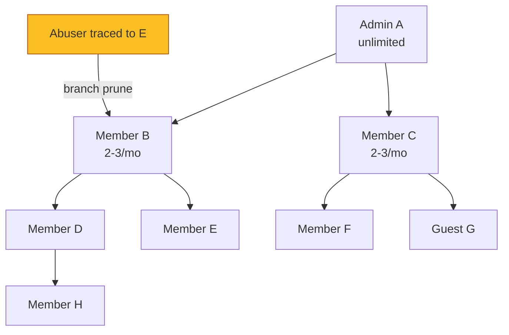

# RFC-002 — Invite Capability Tokens

**RFC ID:** `RFC-002`
**Title:** Invite Capability Tokens for Satellite Admission
**Author:** iyou_home engineering (fed. protocol: `omni_social`)
**Target Release:** `v0.2.1+`
**Status:** Implemented (`commit 9dfcfb3`) — Living Specification
**License Header:** GPL-3.0-or-later — Copyright (C) 2026 David Byers dba Byers Brands

---

## 1. Problem Statement

Autonomous satellite nodes (e.g., a community `iyou_wun` instance or a
self-hosted hub) currently accept new members with no gate beyond a
self-asserted DID. Unrestricted joining produces two compounding exposures:

1. **Sybil surface.** A single adversary mints unbounded DIDs (each costs one
   OS-random seed) and floods a satellite with sock-puppet profiles, vote
   ballots (`kind:1112`), and trust-graph manipulation to farm vetting
   milestones.
2. **Legal exposure.** Satellite operators cannot demonstrate *for whom* they
   admitted members, *who vouched* for them, or *when* access was revoked —
   which is indefensible under community-safety and age-regulation frameworks
   (see RFC-004) when illicit behavior originates from an unvetted entry.

This RFC introduces **signed invite capability tokens**: a cryptographically
bound, quota-limited admission credential that (a) makes every join traceable
to an issuer in a referral graph, (b) caps the blast radius of a compromised
or abusing member, and (c) gives operators a first-class `REVOKE` primitive.

---

## 2. Goals / Non-Goals

### 2.1 Goals

- Every satellite admission carries a signed token whose validity is
  independently verifiable by the node.
- Referral hierarchy (`Issuer DID → Child DID`) is recorded for abuse tracing
  and branch pruning (cut an abuser's entire subtree in one action).
- Tiered issuance quotas prevent invite-farming; vetting milestones unlock
  member issuance.
- The WebSocket join lifecycle is a strict handshake gate: never open a
  session before validation.

### 2.2 Non-Goals

- Global identity scoring or KYC. Tokens attest *invite lineage + tier*, not
  government identity.
- Replacing the existing DID auth challenge (`sign` / `sign_auth_challenge`).
  The invite token **augments** the challenge handshake, it does not replace it.

---

## 3. Terminology

| Term | Meaning |
|:---|:---|
| **Satellite** | A server-side node (e.g. `iyou_wun`, `iyou_hive`, community hub) that admits members over WebSocket. |
| **Issuer** | A DID granted issuance quota (Admin: unlimited; Member: capped). |
| **Child DID** | The DID admitted using an invite token issued by a parent DID. |
| **Invite graph** | The directed `Issuer → Child` tree persisted on the node. |
| **Handshake gate** | The mandatory 4-phase WebSocket join lifecycle (§6). |

---

## 4. Threat Model

| Threat | Mitigation |
|:---|:---|
| Bulk DID minting (Sybil) | Quota caps per issuer + vetting milestones; `nonce` uniqueness; node-side rate limits per issuer DID. |
| Token replay | Single-use consumption bound to the first presenting DID; `uses_count < max_uses`; `nonce` idempotency. |
| Token forgery | Ed25519 signature from the issuer's L1 DID; node verifies against issuer's DID document; time window via `expires_at`. |
| Issuer compromise | `invite_revoke` (or ban elevation, RFC-003) prunes the issuer's whole subtree from the invite graph. |
| Refusal to vet | Member issuance hard-gated on vetting milestones (§5.2) evaluated from on-node ledger state. |
| Legal discovery gaps | Immutable invite audit table (append-only, ban-entangled) retained on the node. |

---

## 5. Invite Capability Token

### 5.1 Data Structure

The token is a signed JSON envelope. The inner `payload` is the capability;
the outer envelope carries the issuer's L1 Ed25519 signature over the
SHA-256 of the canonical-encoded payload.

```json
{
  "v": 1,
  "issuer_did":  "did:key:z6Mk...issuer_l1_did",
  "satellite_id": "wss://relay.iyou.me",
  "nonce":       "3f2a9c...64-hex-random",
  "max_uses":    1,
  "uses_count":  0,
  "tier":        "member",
  "created_at":  1727635320,
  "expires_at":  1730322000,
  "scope":       ["join", "relay:read", "relay:write"],
  "signature":   "z58DAdFfa9SkqZMVPxAQpic7ndTn21... (Ed25519, issuer L1)"
}
```

| Field | Type | Constraints |
|:---|:---|:---|
| `v` | int | Token schema version, current `1`. |
| `issuer_did` | string (`did:key:`) | MUST be the issuer's **L1** persona (never L0 Anchor — bridge exposure rules). |
| `satellite_id` | string (URL) | The node this token is valid for. Empty string = portable (any node in the mesh). |
| `nonce` | string (hex ≥ 16 bytes) | Uniqueness + replay idempotency key. |
| `max_uses` | int | 1 for single-use admissions (default); Members MAY issue shared family tokens with `max_uses` ≤ 4. |
| `uses_count` | int | Incremented by the node on each successful admission; MUST be ≤ `max_uses`. |
| `tier` | enum | `admin` \| `member` \| `guest`. |
| `created_at` | unix | Issuance time. |
| `expires_at` | unix | MUST be `created_at + ≤ 90 days`. Nodes reject expired tokens. |
| `scope` | string[] | Whitelist of capabilities granted; node MUST intersect with tier defaults. |
| `signature` | string | Ed25519 over SHA-256 of canonical payload (`v…scope`, no signature field). |

**Canonical signing input (JSON with sorted keys, no whitespace):**

```
SHA-256( json({"v":1,"issuer_did":...,"satellite_id":...,"nonce":...,
               "max_uses":...,"uses_count":...,"tier":...,"created_at":...,
               "expires_at":...,"scope":[...]}) )
```

### 5.2 Tiered Quotas & Vetting

| Tier | Invite creation | Cap (rolling 30d) | Vetting unlock |
|:---|:---|:---|:---|
| **Admin** (`admin_dids` on node) | Unlimited | none | n/a — pre-configured operator DID |
| **Member** | Unlocked after **all** milestones | 2–3 invites/month | + account age > 14 days + ≥ 5 mutual contacts + 0 moderation flags |
| **Guest** | None | 0 | read-only sessions; cannot issue |

Member issuance is evaluated **at mint time against on-node ledger state**:

```sql
-- Vetting predicate (member can mint when this rowset is satisfied)
SELECT (julianday('now') - julianday(joined_at, 'unixepoch')) > 14  AS age_ok,
       (SELECT COUNT(*) FROM mutual_contacts WHERE did = :issuer) >= 5 AS contacts_ok,
       (SELECT COUNT(*) FROM moderation_flags WHERE subject_did = :issuer AND resolved = 0) = 0 AS clean_ok
FROM memberships WHERE did = :issuer;
```

### 5.3 Invite Graph (Referral Hierarchy)

The graph is a directed tree persisted on the node; every admission inserts a
`(parent_did, child_did, token_nonce)` edge.



**Branch pruning:** banning `E` (§RFC-003 `moderation_ban`) cascades to prune
`E`'s subtree (here none) and **re-keys** every invite token `E` issued
(their `nonce` prefix is added to a node-side `revoked_nonces` set, so all
future presentations fail validation).

| Column | Type | Notes |
|:---|:---|:---|
| `edge_id` | INTEGER PK AUTOINCREMENT | |
| `parent_did` | TEXT NOT NULL | Issuer |
| `child_did` | TEXT NOT NULL | Admitted member |
| `token_nonce` | TEXT NOT NULL UNIQUE | Replay + revocation handle |
| `tier_at_issue` | TEXT NOT NULL | `admin`/`member`/`guest` |
| `created_at` | INTEGER NOT NULL | unix |
| `revoked_at` | INTEGER NULL | set by `invite_revoke` / ban cascade |
| `banned_under` | INTEGER NULL | FK → `banned_identities.event_id` |

### 5.4 Kind Registry (`1600`–`1699`, reserved by this RFC)

| Kind | Name | Signer | Notes |
|:---|:---|:---|:---|
| `1601` | `invite_issue` | Issuer L1 | Human-readable mirror of the token (payload) for the invite audit UI. |
| `1602` | `invite_use` | Child L1 | Acceptance event; **co-signed** by issuer (e.g., tag `["p", issuer_did]` + `["sig", …]`); recorded at admission. |
| `1603` | `invite_revoke` | Issuer L1 / Admin | Carries `revoked_nonces` (array) for branch pruning. |
| `1604` | `moderation_ban` | Admin L1 | See RFC-003 §4. |
| `1605` | `moderation_tombstone` | Admin L1 | See RFC-003 §5. |

---

## 6. Handshake Gate Sequence

The join lifecycle is a **strict 4-phase state machine**. A connection in any
phase other than `OPEN` that sends application frames is dropped (`403`).

```mermaid
stateDiagram-v2
    [*] --> CHALLENGE: TCP/TLS established\n(satellite sends nonce)
    CHALLENGE --> AUTH: client: signed auth + invite token
    CHALLENGE --> DENIED403: timeout (10s) / malformed
    AUTH --> VALIDATION: node verifies sig, nonce, quota, graph
    VALIDATION --> OPEN: all checks green\n(send "OPEN" frame)
    VALIDATION --> DENIED403: any check fails
    OPEN --> [*]: close / session end
    OPEN --> DENIED403: uses_count exceeded mid-session\n(rare; from revocation)
    DENIED403 --> [*]: terminate ("termination_reason" frame)
```



```mermaid
sequenceDiagram
    participant C as Client (iyou_home L1)
    participant N as Satellite node
    participant G as Invite graph ledger

    N->>C: {"type":"auth_challenge","nonce":"N1","ttl":10}
    C->>C: sign(N1) with L1 Ed25519
    C->>N: {"type":"auth_response","did":C,"signature":S,
            "invite_token":{...payload+signature...}}
    N->>N: verify signature(S, N1) against DID doc
    N->>N: verify invite sig (issuer) + nonce + expiry
    N->>N: verify satellite_id match + tier/scope intersection
    N->>G: INSERT edge; uses_count := uses_count + 1
    G-->>N: ok
    alt all green
        N->>C: {"type":"open","session_id":"...","tier":"member"}
    else any check failed
        N->>C: {"type":"auth_status","status":"denied","code":403,
                "termination_reason":"INVITE_INVALID|EXPIRED|USED|REVOKED|SYBIL_RATE"}
        N->>N: close socket, log to invite audit
    end
```

**Denial codes (wire):**

| Code | Meaning |
|:---|:---|
| `INVITE_MISSING` | No token presented |
| `INVITE_INVALID` | Bad signature / payload shape |
| `INVITE_EXPIRED` | `now > expires_at` |
| `INVITE_USED` | `uses_count >= max_uses` or nonce consumed |
| `INVITE_REVOKED` | nonce in `revoked_nonces` / issuer pruned |
| `INVITE_SCOPE` | `satellite_id` mismatch or tier/scope conflict |
| `SYBIL_RATE` | Issuer exceeded hourly admission rate |

---

## 7. Rust Reference

```rust
#[derive(Serialize, Deserialize)]
pub struct InviteCapabilityToken {
    pub v: u8,
    pub issuer_did: String,
    pub satellite_id: String,          // "" = portable
    pub nonce: String,
    pub max_uses: u32,
    pub uses_count: u32,
    pub tier: InviteTier,              // Admin | Member | Guest
    pub created_at: u64,
    pub expires_at: u64,
    pub scope: Vec<String>,
    #[serde(default)]
    pub signature: String,
}

pub enum InviteTier { Admin, Member, Guest }

pub struct InviteEnvelope {
    pub token: InviteCapabilityToken,   // canonical payload WITHOUT signature
    pub signature: String,              // Ed25519(SHA-256(canonical(token)))
}

pub struct HandshakeOutcome {
    pub code: HandshakeCode,            // Open | Denied
    pub termination_reason: Option<DenialCode>,
    pub session_id: Option<String>,
    pub vetted_tier: Option<InviteTier>,
}

pub fn validate_invite(
    token: &InviteCapabilityToken,
    issuer_pubkey_b64: &str,
    satellite_id: &str,
    ledger: &rusqlite::Connection,
) -> Result<HandshakeOutcome, HandshakeOutcome>;
```

**Enforcement points in `iyou_home`:**

- New `satellite_handshake` arm in `src-tauri/src/bridge.rs` (or extension
  module) handling `auth_challenge` / `auth_response` frames before any
  `OMNI_*` / `sign_*` frame is processed.
- New SQLite tables (`invite_graph`, `revoked_nonces`) in the node's
  `nostr_events.db` (rusqlite, bundled).
- New module `src-tauri/src/invites.rs` owning mint/validate/prune; IPC:
  `create_invite_token`, `list_invites`, `revoke_invite`, `invite_graph`.

---

## 8. UI/UX — Invite Management (member-facing surface in iyou_home)

```
┌──────────────────────────────────────────────────────────────┐
│  📨 Invites  (tier: member · quota used 1/3 this month)      │
├──────────────────────────────────────────────────────────────┤
│  ┌──────────────┬──────────────┬──────────────┬────────────┐ │
│  │ New invite   │ Issued       │ Used         │ Status     │ │
│  ├──────────────┼──────────────┼──────────────┼────────────┤ │
│  │ z6Mk…a1      │ 2026-09-12   │ 2026-09-13   │ ● live     │ │
│  │ z6Mk…b4      │ 2026-09-05   │ —            │ ○ unused   │ │
│  │ z6Mk…c9      │ 2026-08-30   │ 2026-08-31   │ ● revoked  │ │
│  └──────────────┴──────────────┴──────────────┴────────────┘ │
│  [ + Issue invite ]   [ 🔍 Trace subtree ]  [ ↷ Revoke ]     │
│                                                               │
│  Vetting status: ✅ 14d account · ✅ 6 mutual contacts        │
│                 · ✅ 0 moderation flags  → 3 invites free     │
└──────────────────────────────────────────────────────────────┘
```

---

## 9. Acceptance Criteria

- [ ] `create_invite_token` refuses when the caller fails the membership
  vetoing predicate (Member) or is unlisted (non-Admin, non-Member).
- [ ] A replay of the same token nonce by a different DID is denied
  (`INVITE_USED`); a second admission with the same DID is also denied after
  `uses_count == max_uses`.
- [ ] Token verification fails on: bad issuer signature, expired window,
  `satellite_id` mismatch, revoked nonce.
- [ ] `revoke_invite` inserts the nonce into `revoked_nonces` and re-keys the
  issuer's entire subtree.
- [ ] Handshake never transitions to `OPEN` without a fully validated token;
  application frames before `OPEN` yield `403`.
- [ ] Unit tests: mint/validate/revoke + graph prune + quota math (vitest n/a
  for Rust: `cargo test`).

---

## 10. Open Questions

1. Should `scope` be a node-enforced allow-list or advisory (client-declared)?
   (Proposal: node-enforced intersection with tier defaults.)
2. Guest tier: read-only for how long, and who upgrades guests?
3. Do family-shared tokens (`max_uses` ≤ 4) need a `family_key` field so
   member siblings share a branch? (Draft: no — each admission is a node.)

---

## 11. Document History

- **2026-09-18 (v1.0.0):** Initial RFC. Token schema, tiered quotas, invite
  graph with branch pruning, 4-phase handshake gate, kind registry
  `1600–1699`, SQLite ledger, IPC/module plan.
- **2026-09-19 (v1.1.0):** Promoted from Draft to **Implemented** (commit
  `9dfcfb3`) for release v0.2.2; status header updated.