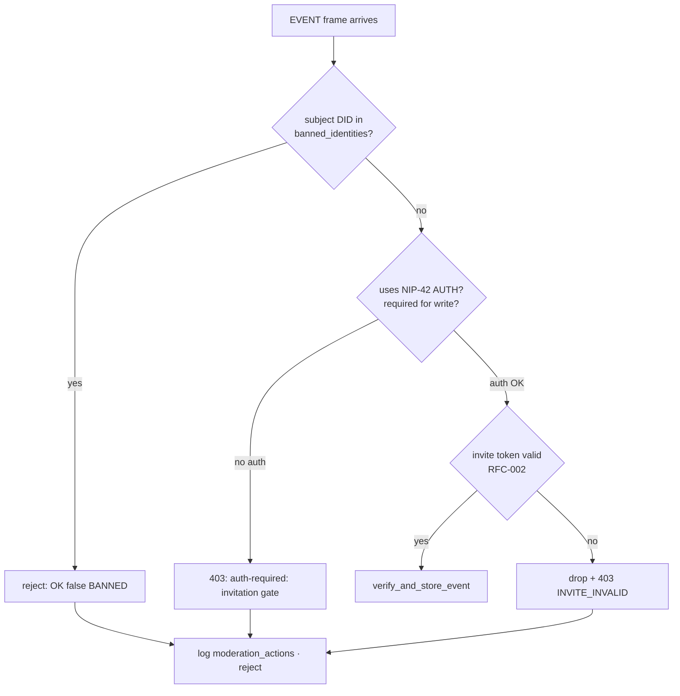
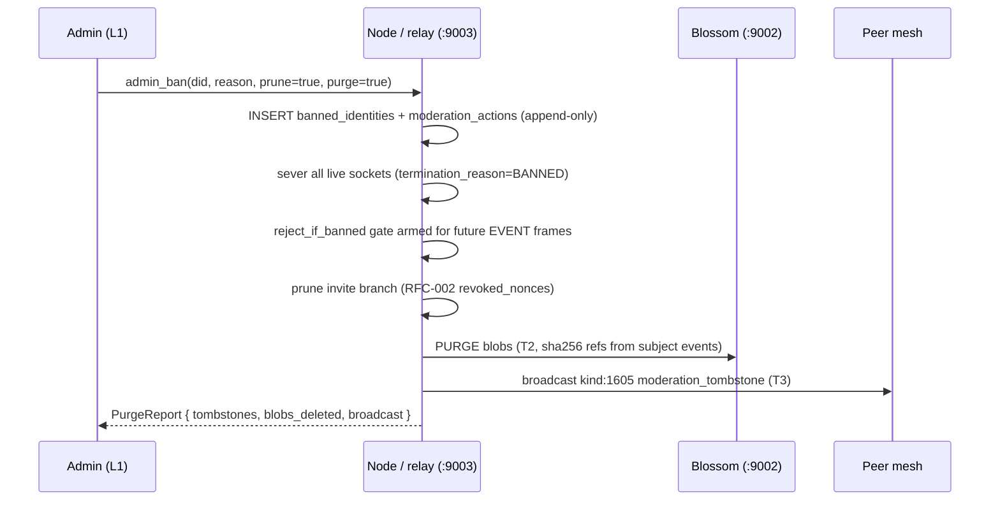

# RFC-003 — Satellite Admin & Moderation

**RFC ID:** `RFC-003`
**Title:** Satellite Administrator Tooling: Bans, Invite Revocation, and Local Purge
**Author:** iyou_home engineering (fed. protocol: `omni_social`)
**Target Release:** `v0.2.1+`
**Status:** Implemented (`commit a56094f`) — Living Specification
**License Header:** GPL-3.0-or-later — Copyright (C) 2026 David Byers dba Byers Brands

---

## 1. Problem Statement

Satellite node operators (community `iyou_wun`/`iyou_hive` hubs, self-hosted
relays) can currently react to abuse only by editing databases by hand or
blocking at the network layer. They have **no administrative tools** to:

- Ban bad actors **locally** (a native ledger, not a firewall hack);
- Revoke invites issued by an abuser's branch (RFC-002 graph pruning);
- Sever an **active** connection with a machine-readable termination reason;
- **Purge** cached events, comments, and media hashes (Blossom) belonging to
  a removed member — including forwarding deletion events to peer nodes.

Without these primitives, illicit material persists in local caches and
replication, and operators cannot produce a defensible moderation trail.

---

## 2. Goals / Non-Goals

### 2.1 Goals

- `admin_dids`-gated admin UI surface (who may moderate = who the operator
  configured).
- Immutable local `banned_identities` ledger (DID, reason, evidence hashes,
  timestamps, banning admin).
- Three moderation primitives: **sever** (live connection), **reject**
  (NIP-01/42 inbound auth interception), **tombstone & purge** (cascade +
  peer broadcast).
- Full invite audit + 1-click ban/purge from one admin panel.

### 2.2 Non-Goals

- Global internet-wide bans (each node is autonomous; bans are node-local by
  default, optionally federated via moderation events).
- Content classification / AI screening on the node (see `iyou_safe`).
- Replacing the invite capability tokens of RFC-002 — moderation *consumes*
  the invite graph.

---

## 3. Access Control

### 3.1 `admin_dids`

AuthZ is evaluated from the node's operator config (e.g., `config/admin.yaml`
on the node, mirrored locally for the iyou_home admin surface).

```yaml
# node config (satellite-side)
admin_dids:
  - did:key:z6Mk...operator_a_l1
  - did:key:z6Mk...operator_b_l1
```

The iyou_home admin panel is rendered **only** when the vault's active L1 DID
is a member of the connected node's `admin_dids` (node answers an
`ADMIN_PROBE` frame with `{admin: true|false}`; the UI never trusts a client-
declared role).

```rust
pub struct AdminAuthResult {
    pub authorized: bool,
    pub admin_did: Option<String>,
    pub node_claimed: String,   // satellite_id the assertion is valid for
}

/// Every moderation IPC double-checks at the backend before touching a table.
pub fn require_admin(
    app: &AppHandle,
    node_admin_dids: &[String],
) -> Result<String, String> { /* active L1 DID ∈ admin_dids ? */ }
```

| Surface | Admin | Member | Guest |
|:---|:---|:---|:---|
| View member directory | ✅ | ❌ | ❌ |
| View invite audit table | ✅ | own invites (RFC-002 §8) | ❌ |
| Sever connection | ✅ | ❌ | ❌ |
| Ban identity (+ cascade prune) | ✅ | ❌ | ❌ |
| Tombstone & purge | ✅ | ❌ | ❌ |

---

## 4. Banned Identities Ledger

### 4.1 SQLite DDL (`nostr_events.db` — rusqlite bundled)

```sql
CREATE TABLE IF NOT EXISTS banned_identities (
    event_id       INTEGER PRIMARY KEY AUTOINCREMENT,
    did            TEXT    NOT NULL,
    ban_reason     TEXT    NOT NULL,             -- operator-supplied
    banned_by_did  TEXT    NOT NULL,             -- admin who acted
    banned_at      INTEGER NOT NULL,             -- unix
    expires_at     INTEGER,                      -- NULL = permanent
    evidence_sha256 TEXT,                        -- optional Blossom hash refs (JSON array)
    scope          TEXT    NOT NULL DEFAULT 'node',  -- 'node' | 'federated'
    severed_conns  INTEGER NOT NULL DEFAULT 0,   -- live severance count
    UNIQUE(did, scope)
);

CREATE INDEX IF NOT EXISTS idx_banned_did ON banned_identities(did);
CREATE INDEX IF NOT EXISTS idx_banned_at  ON banned_identities(banned_at);

-- Immutable moderation audit trail (append-only; ban rows never UPDATE)
CREATE TABLE IF NOT EXISTS moderation_actions (
    action_id  INTEGER PRIMARY KEY AUTOINCREMENT,
    kind       TEXT NOT NULL,   -- 'ban' | 'unban' | 'sever' | 'reject' | 'purge'
    subject_did TEXT NOT NULL,
    actor_did  TEXT NOT NULL,
    payload    TEXT NOT NULL,   -- signed moderation event (kind 1604/1605)
    created_at INTEGER NOT NULL
);
```

### 4.2 Wire / Kind

`moderation_ban` (`kind:1604`, signed by admin L1):

```json
{
  "kind": 1604,
  "pubkey": "admin L1 hex",
  "created_at": 1760000000,
  "content": "",
  "tags": [
    ["p", "banned_did"],
    ["reason", "spam / CSAM ref"],
    ["scope", "node"],
    ["expires", "1762600000"],
    ["evidence", "sha256:ab12…"],
    ["prune_branch", "true"]
  ]
}
```

---

## 5. Moderation Actions

### 5.1 Sever — Active Connection Termination

On ban issuance (or manual "Disconnect"), every live WebSocket to the node
from the subject DID is terminated with a typed frame:

```
{"type":"auth_status","status":"denied","code":403,
 "termination_reason":"BANNED","ban_id":42,
 "ban_reason":"spam / CSAM ref","banned_by":"z6Mk…admin"}
```

The socket is closed after the frame flushes; `severed_conns` increments.
The same termination path is reused by RFC-002 denials.

### 5.2 Reject — Inbound Event Interception (NIP-01 / NIP-42)

The local relay's `EVENT` path gains a pre-store gate:



Concretely, `verify_and_store_event` (or its caller) is wrapped by
`reject_if_banned(pubkey, &db) -> Result<(), BanReason>`:

```rust
pub fn reject_if_banned(pubkey: &str, db: &Arc<Mutex<rusqlite::Connection>>)
    -> Result<(), String> {
    // SELECT reason, banned_by_did FROM banned_identities WHERE did=?1 AND
    // (expires_at IS NULL OR expires_at > unix_now())
    // Ok(()) if clean; Err("BANNED: <reason>") otherwise.
}
```

### 5.3 Tombstone & Purge Engine

Purge is a two-stage cascade — **tombstone first, delete second**, because a
premature delete of the authoritative event row while peer replication is
in flight would resurrect content.

| Stage | Operation | Scope |
|:---|:---|:---|
| T1 Tombstone | `INSERT tombstoned_events(event_id, subject_did, purged_by, at)`; mark rows as `deleted=1` | local `nostr_events.db` events authored by subject (kinds 1, 1063, 30023, 1111, 1112…) |
| T2 Media purge | `DELETE FROM blobs WHERE sha256 IN (...)` via Blossom `DELETE /<sha256>` | `blobs/` store (`:9002`) |
| T3 Peer broadcast | Publish `moderation_tombstone` (`kind:1605`) with `["e", event_id]` refs to peer mesh relays | federation |
| T4 Local GC | Recompute Merkle/ledger refs (`poll_ledger.json`, governance) referencing purged ballots | governance auditor |



```rust
pub struct PurgeRequest {
    pub subject_did: String,
    pub purged_by: String,        // admin DID (validated)
    pub cascade: PurgeCascade,    // Votes | Media | Events | All
    pub broadcast_to_peers: bool, // publish kind:1605
}

pub fn tombstone_and_purge(req: PurgeRequest, db: &rusqlite::Connection)
    -> Result<PurgeReport, String>;
// PurgeReport { tombstones: usize, blobs_deleted: usize,
//               events_broadcast: usize }
```

---

## 6. Admin Panel UI Layout

```
┌──────────────────────────────────────────────────────────────────────┐
│ 🛡️ Satellite Admin   node: relay.iyou.me · role: ADMIN               │
├───────────────┬──────────────────────────────────────────────────────┤
│ 📇 Members    │  Member Directory                                     │
│ 📨 Invites    │  ┌──────────────┬───────────┬───────────┬──────────┐ │
│ ⚠️ Bans       │  │ DID          │ Joined    │ Flags     │ Actions  │ │
│ 🗑️ Purges     │  ├──────────────┼───────────┼───────────┼──────────┤ │
│               │  │ z6Mk…a1      │ 09-12     │ 0         │ [⚑ Ban]  │ │
│               │  │ z6Mk…b4      │ 09-05     │ 2 ⚠️      │ [⚑ Ban]  │ │
│               │  │ z6Mk…c9      │ 08-30     │ 12 🔴     │ [⚑ Ban]  │ │
│               │  └──────────────┴───────────┴───────────┴──────────┘ │
├───────────────┼──────────────────────────────────────────────────────┤
│ Invite audit  │  ┌────────────┬──────────┬──────────┬────────┬─────┐ │
│ (RFC-002)     │  │ Issuer     │ Child    │ Tier     │ Used   │ …   │ │
│               │  │ z6Mk…admin │ z6Mk…b4  │ member   │ 1/1    │     │ │
│               │  └────────────┴──────────┴──────────┴────────┴─────┘ │
└───────────────┴──────────────────────────────────────────────────────┘

  [⚑ Ban] modal:
  ┌───────────────────────────────────────────────────┐
  │  Ban identity                                      │
  │  DID: z6Mk…c9                                       │
  │  Reason: [ spam / CSAM ref / harassment …      ]  │
  │  Scope: (•) this node  ( ) federated               │
  │  Expiry: [ permanent ]  ·  Prune invite branch: [x]│
  │  Purge content: [x] cascade events  [x] media      │
  │  Evidence: [ sha256:… + add ]                      │
  │                    [ Cancel ]  [ 1-click Ban 🚫 ]  │
  └───────────────────────────────────────────────────┘
```

---

## 7. IPC Surface (iyou_home client side)

| Command | Description | Admin-gated |
|:---|:---|:---|
| `admin_probe` | `{authorized, admin_did}` for the connected node | — |
| `admin_list_members` | member directory (DID, joined, flags, invite lineage) | ✅ |
| `admin_list_bans` | `banned_identities` rows | ✅ |
| `admin_sever(did)` | live termination ($5.1) | ✅ |
| `admin_ban(did, reason, scope, expires, prune, purge)` | ledger insert + sever + optional cascade | ✅ |
| `admin_unban(did)` | soft-delete ban row (audit keeps origin) | ✅ |
| `admin_purge(did, cascade)` | tombstone & purge engine ($5.3) | ✅ |
| `admin_revoke_invites(issuer)` | RFC-002 branch prune | ✅ |

---

## 8. Acceptance Criteria

- [ ] Non-admin L1 and unlisted DIDs receive `403` for every `admin_*` IPC.
- [ ] Ban inserts an immutable row, severs all live sockets with
  `termination_reason:"BANNED"`, and increments `severed_conns`.
- [ ] Banned DIDs' subsequent `EVENT` frames are rejected pre-store
  (`OK false BANNED`); write path requires NIP-42 AUTH or invite token per
  RFC-002.
- [ ] Purge tombstones events, deletes Blossom blobs by SHA-256, and publishes
  `kind:1605` to peers when `broadcast_to_peers`.
- [ ] `moderation_actions` is append-only; audit trail survives unban.
- [ ] `cargo test` + `npx vitest run` green for new units.

---

## 9. Open Questions

1. Federated bans: signed by node admin and gossiped (kind 1604 with
   `["satellite", relay.iyou.me]`), peers honor or ignore? Default: honor, with
   per-node opt-out.
2. Purge of **OMEMO-encrypted** chat history: content is E2EE; only tombstones
   are purgeable. Should severance also revoke the member's OMEMO device
   bundle (`omemo_store.json`)?
3. Do banned DIDs' **credentials** (`vault.credentials`) get revoked via
   delegated revocation events (like RFC-005's `RevocationTicket`)?

---

## 10. Document History

- **2026-09-18 (v1.0.0):** Initial RFC. `admin_dids` authz, `banned_identities`
  + `moderation_actions` SQLite schemas, sever/reject/tombstone-purge
  primitives, admin panel layout, IPC surface, kind `1604`/`1605`.
- **2026-09-19 (v1.1.0):** Promoted from Draft to **Implemented** (commit
  `a56094f`) for release v0.2.2; status header updated.