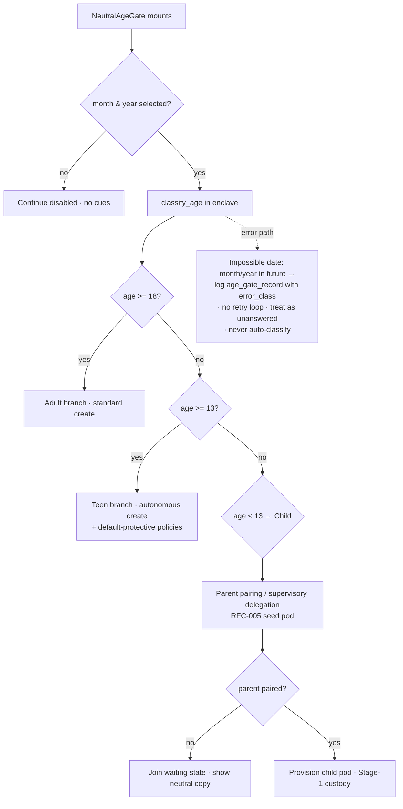
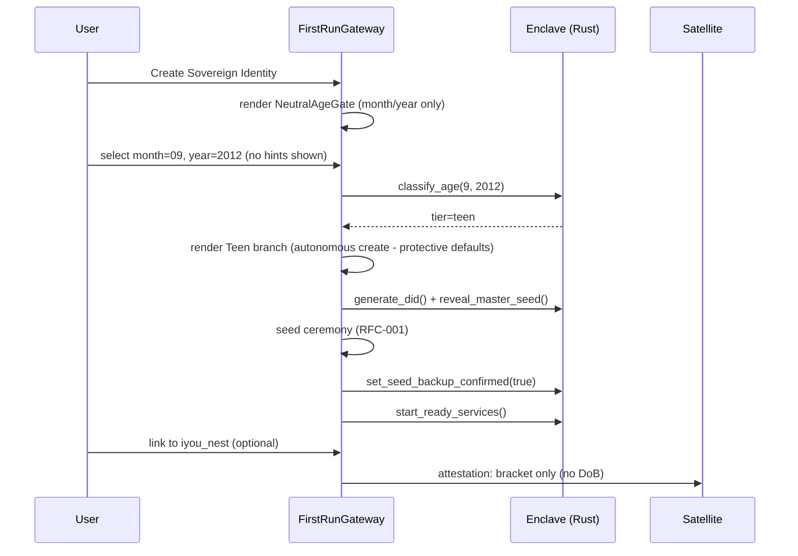

# RFC-004 — Neutral Age Gate & Compliance Architecture

**RFC ID:** `RFC-004`
**Title:** Neutral Age Gate, Three-Tier Minor Framework, and Legal Boundary
**Author:** iyou_home engineering (fed. protocol: `omni_social`)
**Target Release:** `v0.2.1+`
**Status:** Draft (Living Specification — supersedes self-serving "I am 13" checkbox)
**License Header:** GPL-3.0-or-later — Copyright (C) 2026 David Byers dba Byers Brands

---

## 1. Problem Statement

The current onboarding treats age as a self-serving boolean ("I am 13+"
checkbox). That model fails the compliance stack:

- **COPPA** (US, children ≤ 12): requires *verifiable parental consent* before
  collecting personal information — a checkbox cannot produce consent.
- **UK AADC** (Age-Appropriate Design Code): demands best interests of the
  child, age-appropriate application of protections, and that minors are not
  "nudge" engineered into handing over their date of birth or opting out of
  safety defaults.
- **US state teen-safety laws** (e.g., Utah S.B. 152, Arkansas SB 396,
  California AB 2273/2291 era): mandate default-on protective settings and
  parental involvement for minors.

A second, subtler problem: a gate that *validates or hints* at the chosen
birth month/year (e.g., "that means you're 13") both leaks the user's birth
data over nothing and trains minors to lie. The gate must be **neutral**:
two dropdowns, no hints, no validation cues, no pendant information.

---

## 2. Goals / Non-Goals

### 2.1 Goals

- Three-tier framework: **Child (< 13)** — no autonomous root; **Teen
  (13–17)** — autonomous root with default-protective policies; **Adult
  (18+)** — standard sovereign parameters.
- A neutral month/year gate UI with zero feedback signals and precise error →
  branch mappings.
- Formal legal boundary: `iyou_home` desktop client (unhosted, zero-telemetry
  local software) is **architecturally separate** from autonomous Satellite
  Operators; a disclaimer audit log records what the user was shown.
- No cleartext `birthDate` ever leaves the device or enters satellite OIDC
  claims (aligns with `DEPENDENT_IDENTITY_AND_GRADUATION_SPEC.md` §3
  `DependentTokenSlot`).

### 2.2 Non-Goals

- Government-ID verification on device (explicitly rejected by the ecosystem
  WoT model — see DEP spec §1.1).
- Legal advice or juror of operator liability. The RFC documents the
  architectural separation and audit trail that operators need to carry their
  own compliance burden.

---

## 3. Three-Tier Age Framework

| Tier | Ages | Autonomous L0/L1 root | Protections | Ecosystem linking |
|:---|:---|:---|:---|:---|
| `Child` | < 13 | **Disabled.** Parental device pairing / supervisory delegation required (RFC-005 seed pod, Stage-1 custody). | Safe-relay only; inbound WoT ≤ 1; no public persona publish; parent co-sign capabilities. | Parent's `iyou_nest` (family storage / gaming) only. |
| `Teen` | 13–17 | **Permitted.** Autonomous L0/L1 mint. | Default-on: restricted indexing; DMs from **mutual contacts only**; consent-worthy defaults (RFC-005 Stage-2). | Optional link to parent's `iyou_nest`; peer circles (RFC-002 tier `member` after vetting). |
| `Adult` | 18+ | **Standard** sovereign parameters. | Full WoT; standard capabilities. | All satellites, full mesh. |

**Tier transitions** are **upgrades only** and monotonic at runtime without
supervision: `Child → Teen → Adult`. Down-grades require supervisory action
(RFC-005). The tier is stored as an **age-bracket record**, never a raw
birth date.

---

## 4. Neutral Gate UI Component

### 4.1 Design Rules (hard constraints)

1. **Two controls only:** Month (12 options) + Year (e.g., 1900 → current).
2. **No hints:** no "your age is…", no celebratory/coaching copy, no cohort
   counts, no validation success states linked to brackets.
3. **No lexical bias:** the two dropdowns are unordered-neutral (months always
   Jan-Dec; years *descending* is prohibited — descending normalizes
   "youngest first" scanning; use year ascending from oldest) so distance from
   today is not inferable from widget position.
4. **Continue disabled until both controls have a value.** No error text on
   incomplete state (silence is not a hint).
5. **Classification is opaque:** the tier is computed locally and the UI
   shows only the resulting branch (parent pairing vs. create vs. standard).

### 4.2 Component Contract

```tsx
interface NeutralAgeGateProps {
  onDecision: (record: AgeGateRecord) => void;
  /** Parent pairing for Child tier is a separate supervisory flow (RFC-005). */
  onNeedsParentPairing: () => void;
}

interface AgeGateRecord {
  month: number;            // 1-12
  year: number;             // 4-digit
  tier: "child" | "teen" | "adult";
  computed_at: number;      // unix
  gate_version: "neutral-v1";
  // NO raw DoB string, NO hints, NO IP/telemetry captured.
}
```

```tsx
// Pseudo-rust equivalent (classification runs in the Rust enclave)
pub enum AgeTier { Child, Teen, Adult }

pub fn classify_age(month: u8, year: u16, now_unix: u64) -> AgeTier {
    // 13th birthday passes the first day of the birth month; 18th likewise.
    // Child  : age < 13
    // Teen   : 13 <= age < 18
    // Adult  : age >= 18
    let age = years_since(month, year, now_unix);
    if age < 13 { AgeTier::Child } else if age < 18 { AgeTier::Teen } else { AgeTier::Adult }
}
```

### 4.3 Flow & Error Branch Mappings



| Branch trigger | UI reaction | Log |
|:---|:---|:---|
| Month/year unset | Continue disabled | — |
| Future date (year > current, or after current month) | Neutral "please re-check" (no age hint); single re-entry allowed | `age_gate_record.error_class = "future_date"` |
| Invalid year (< 1900) | Same neutral re-check | `error_class = "out_of_range"` |
| Repeated invalid input | Escalate to parent-pairing/assisted flow for Child tier; standard for Adult (with audit) | `error_class = "repeated_invalid"` |
| Closed window (back/quit) | No state persisted; next boot asks again | — |

**Anti-nudge invariant:** the gate never reveals the computed tier to the
user. The tier is only observable through the branch UI it leads to.

---

## 5. Persistence & Attestation

### 5.1 Vault / Preferences Record

The classification result is persisted as an attestable, privacy-minimal
record — **not** a raw birth date:

```json
{
  "age_gate": {
    "gate_version": "neutral-v1",
    "tier": "teen",
    "computed_at": 1760000000,
    "record_sha256": "ab12… (hash of month/year + tier; kept for audit integrity)",
    "month": 9,
    "year": 2012
  }
}
```

- Stored in `preferences.json` (frontend-invisible), mirrored to the vault as
  an **`AgeBracketCredential`-style** sealed attestation per RFC-005/DEP spec
  when a parent issues supervision.
- The raw month/year **never** enters OIDC claims (satellites see only the
  bracket via `DependentTokenSlot`; RU: DEP spec §3.1).

### 5.2 Teen Default-Protective Policies (must be *default-on*)

| Policy | Default (Teen) | Adult override? |
|:---|:---|:---|
| Feed/public indexing | Restricted (mutual contacts only) | user opt-in |
| Direct messages | Mutual contacts only | user opt-in |
| Public persona publish (`kind:0`) | Off | user opt-in |
| L2 burner creation | Allowed (Stage-2) | n/a |
| Relays | Safe list only | user extend |

---

## 6. Legal Boundary Architecture

### 6.1 Separation of Responsibilities

```
┌───────────────────────────────┐        ┌────────────────────────────────────┐
│  iyou_home desktop client     │        │  Autonomous Satellite Operators    │
│  (this repo)                  │        │  (iyou_wun, iyou_hive, hubs…)       │
│  • unhosted, local enclave    │        │  • consent docs, ToS, age rules     │
│  • zero telemetry, loopback   │        │  • moderation (RFC-003)             │
│  • key custody, no DoB leak   │  WSS   │  • invite gates (RFC-002)           │
│  • NeutralAgeGate runs here   │───────▶│  • receive bracket attestations     │
│  • disclaimer audit log       │        │    (never raw DoB)                  │
└───────────────────────────────┘        └────────────────────────────────────┘
```

1. **Client:** generates keys, classifies age neutrally, holds the seed,
   records disclaimers shown, sends only bracketed attestations.
2. **Operators:** own community standards, moderation, and jurisdiction-specific
   consent law compliance; never hold a minor's birth data or root seed.

### 6.2 Disclaimer Audit Log Schema

Every legal/consent surface (EULA, COPPA parental-consent notice, teen-safety
notice, satellite-specific ToS) is versioned and its exposure recorded so an
operator can demonstrate what was shown, when, and to whom.

```json
// {app_data}/disclaimer_audit.json — append-only array
{
  "version": 1,
  "entries": [
    {
      "entry_id": "uuid-v4",
      "disclaimer_sha256": "abc…",
      "disclaimer_key": "eula-v2 | coppa-parental-consent-v1 | teen-safety-v1 | satellite-tos:relay.iyou.me",
      "version_label": "1.4.0",
      "shown_at": 1760000000,
      "accepted_at": 1760000045,
      "locale": "en-US",
      "device_id": "anon-8-hex",          // local, non-PII handle
      "presented_did": "did:key:z6Mk…",   // active L1 (or "readonly" pre-provision)
      "outcome": "accepted | declined | dismissed",
      "context": "onboarding | update | satellite-connect"
    }
  ]
}
```

Rust:

```rust
#[derive(Serialize, Deserialize)]
pub struct DisclaimerAuditEntry {
    pub entry_id: String,
    pub disclaimer_sha256: String,
    pub disclaimer_key: String,
    pub version_label: String,
    pub shown_at: u64,
    pub accepted_at: Option<u64>,
    pub locale: String,
    pub device_id: String,
    pub presented_did: String,
    pub outcome: DisclaimerOutcome, // Accepted | Declined | Dismissed
    pub context: String,
}

pub fn record_disclaimer(app: &AppHandle, entry: DisclaimerAuditEntry)
    -> Result<(), String>;  // append-only write, same atomic quarantine rules as vault
```

**Boundary invariants:**

- The audit log contains **no** birth data, no IP addresses, no telemetry.
- `declined` disclaimers block the corresponding capability locally.

---

## 7. Sequence — Teen Onboarding Through FirstRunGateway



---

## 8. Compliance Matrix

| Regulation | What it demands | How RFC-004 satisfies |
|:---|:---|:---|
| COPPA (≤12) | Verifiable parental consent before data collection | Child tier blocks autonomous root; parent pairing + supervisory delegation (RFC-005); consent disclaimer audit entry |
| UK AADC | Best interests, age-appropriate, no nudge | Neutral gate (no hints); protective defaults; bracket-only attestation |
| Utah S.B. 152 / AR SB 396 | Default-on parental tools for minors, curator defaults | Teen tier defaults; parent co-sign capability tokens (RFC-005) |
| GDPR-K | Lawful basis, transparency | Disclaimer audit log; no telemetry; local classification |
| Ecosystem DEP spec | Zero-PII brackets, WoT distance | Bracket attestation via `DependentTokenSlot`; `age_gate` record sealed |

---

## 9. Acceptance Criteria

- [ ] NeutralAgeGate renders exactly month+year; Continue is disabled until
  both are set; zero bracket-revealing copy exists in the DOM.
- [ ] `classify_age` boundaries are unit-tested: day-before-13th-birthday → Child
  (no — 13th birthday = first day of birth month → Teen), day-before-18th → Teen,
  on-or-after → Adult.
- [ ] Child tier cannot reach `generate_did`; the only exit is parent pairing.
- [ ] Teen tier applies protective defaults that persist in `preferences.json`.
- [ ] No raw month/year (or derived DoB) is ever emitted to satellite IPC
  claims; only the sealed bracket.
- [ ] Disclaimer audit log is append-only, atomic-quarantined, and blocks
  capabilities on `declined`.
- [ ] `cargo test` + `npx vitest run` green.

---

## 10. Open Questions

1. Year range floor (1900 vs. 1920) — affects `out_of_range` mapping only.
2. Should Teen tier require a **re-verification cadence** (e.g., annual
   neutral re-ask) to catch birthday drift into Adult without a raw DoB?
   (Draft: annual silent re-classification is impossible without storing the
   year — the *year* is stored but never transmitted; this is acceptable.)
3. Parental consent notice for Teen linking to `iyou_nest`: mandatory or
   optional attestation entry?

---

## 11. Document History

- **2026-09-18 (v1.0.0):** Initial RFC. Three-tier framework, neutral gate
  design rules + flow, age-gate record schema, legal boundary architecture
  with `disclaimer_audit.json`, compliance matrix.