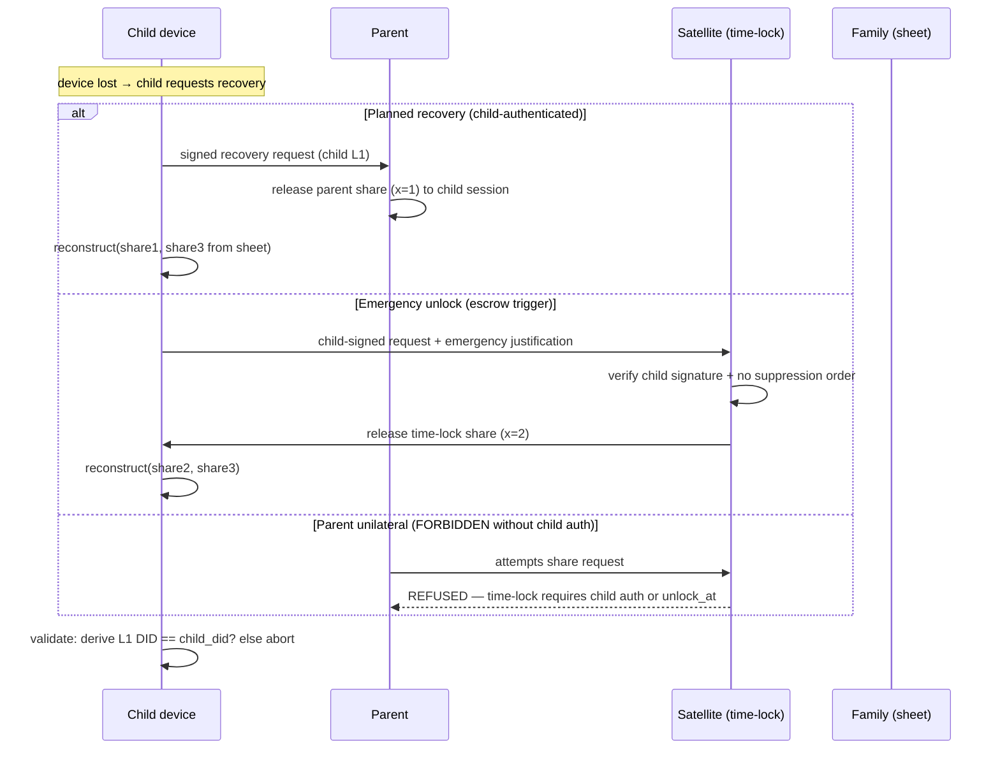
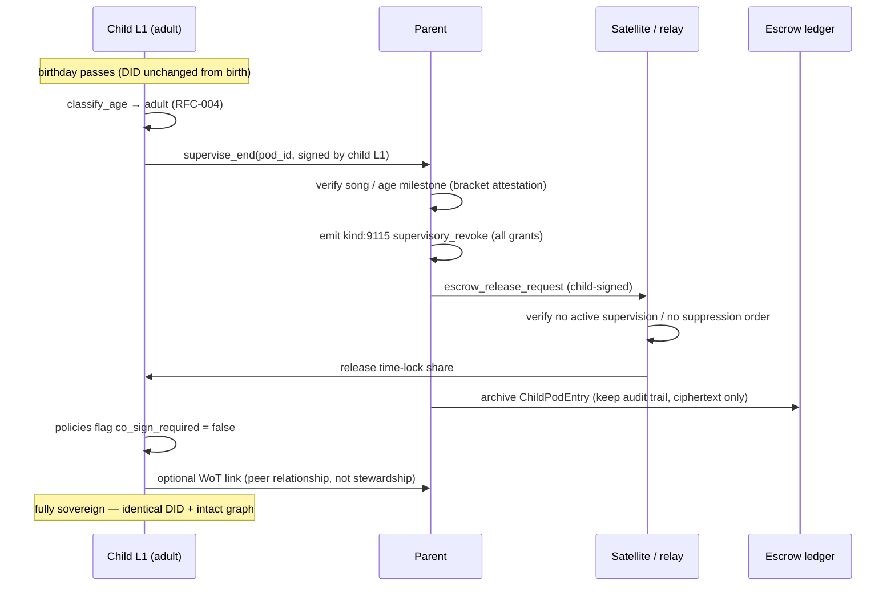

# RFC-005 — Custodial Seed Pods & Sovereign Graduation

**RFC ID:** `RFC-005`
**Title:** Custodial Seed Pods (Edge-Generated Child Seeds), Supervisory Delegation, Threshold Escrow, and Emancipation
**Author:** iyou_home engineering (fed. protocol: `omni_social`)
**Target Release:** `v0.2.1+`
**Status:** Implemented (`commit 5df400b`) — Living Specification
**License Header:** GPL-3.0-or-later — Copyright (C) 2026 David Byers dba Byers Brands

---

## 1. Problem Statement

The ecosystem's dependent-identity spec (`DEPENDENT_IDENTITY_AND_GRADUATION_SPEC.md`,
`OMNI-DEP-GRAD-SPEC-V1`) derives a child's identity from the **parent's root
seed** at `m/iyou/dependent/<index>`. For dependents that run their *own*
device, that design has two structural failures:

1. **Entropy contamination.** The parent's enclave permanently holds every
   child's full derived key material. A single parent-device compromise
   exposes every child for life — and the parent is *able* to silently read a
   child's keys even when it has no legitimate need.
2. **Broken DID migration at adulthood.** "Graduation" then means either
   (a) re-deriving under a fresh seed → **new DID** → every historical event,
   follow, credential, and OIDC session breaks, or (b) the parent bestowing a
   copy of a key it still holds — the graduate's sovereignty is illusory.

This RFC introduces the **custodial seed pod**: the child's root seed is
generated **on the child's device, inside its own hardware enclave**, the
parent **never holds the plaintext seed**, and custody is expressed as (a)
delegable *supervisory capabilities*, (b) **2-of-3 threshold escrow** for
disaster recovery, and (c) a monotonic **emancipation lifecycle** that ends in
a fully sovereign instance with an **identical DID and intact historical
graph**.

---

## 2. Goals / Non-Goals

### 2.1 Goals

- Edge generation: child seed created on child hardware; parent sees only
  public DIDs and pod metadata.
- Supervisory delegation: parent L1 issues capability grants (relay access,
  contact approvals, platform boundaries) with explicit expiry.
- 2-of-3 Shamir escrow (Parent Share + Satellite Time-Lock Share + Physical
  Sheet) enabling disaster recovery without unilateral parental snooping.
- Emancipation at 13 (teen milestone) and 18 (sovereign): capability
  requirements expire, co-signing rules are removed, the DID is unchanged, and
  the historical graph is intact.

### 2.2 Non-Goals

- Replacing the existing parent-device `vault.dependents` derivation path for
  children that *share* the parent device (DEP spec Option B remains).
- Remote key custody by the satellite (it holds one escrow share only, under
  time-lock, never plaintext).
- Government ID verification (see RFC-004).

---

## 3. Terminology

| Term | Meaning |
|:---|:---|
| **Seed pod** | The child-owned unit: child's own `VaultStore` (L0+L1) on the child's device, plus parent-side `ChildPodEntry` metadata (no keys). |
| **Edge generation** | Seed minted on the child's device inside a local hardware enclave. |
| **Supervisory grant** | Parent-issued, expiring capability token (`kind:9114`). |
| **Escrow share** | One Shamir share of the child's seed. Any 2 of 3 reconstruct. |
| **Time-lock share** | Satellite-held share released only after a scheduled unlock (escrow trigger) — prevents parent unilateral recovery while allowing scheduled/emergency recreation. |
| **Co-sign rule** | Child capability gated by parent attestation at creation time (contact approval, relay boundary changes). |
| **Emancipation** | Monotonic removal of supervision; identity unchanged. |

---

## 4. Edge Generation

### 4.1 Protocol

```
[ Parent device ]                            [ Child device ]
                                             
  1. initiate_pod_bind(child_public_did?)   ◀── edges
  2. Parent L1 derives an authenticated       generate_root_seed()
     binding frame over an ephemeral           - 32 raw bytes from the OS
     X25519 session (reuse pairing frame       CSPRNG inside the hardware
     machinery, REVERSED: public material      enclave (Secure Enclave /
     only crosses — NO seed bytes)             StrongBox / TPM)
  3. Parent receives:                         derive L0 (idx 0) + L1 (idx 1)
     { child_did, child_nostr_pubkey,          persist child vault.json
       pod_id, child_device_id }               (base64 envelope, RFC-001)
  4. Parent writes ChildPodEntry (metadata     child exports public DIDs only
     only) + creates escrow shares:             
     - parent keeps share x=1                 
     - satellite receives share x=2           
     - child prints physical sheet x=3        
```

**Hard invariants:**

1. **No plaintext at rest with the parent.** The parent's vault stores
   `ChildPodEntry` metadata and *one Shamir share* — never the seed, never the
   child's L1 private key.
2. **Enclave-local generation.** The child seed is produced by the device's
   hardware crypto provider; the Rust enclave never emits it over IPC except
   to the ceremony UI (RFC-001 rules apply; child tier additionally requires
   parent-pairing before ceremony — RFC-004).
3. **Pod binding authenticity.** The binding frame is signed by the child's
   L1 and verified by the parent before `ChildPodEntry` is written.

### 4.2 Sealing on the Child Device

The child seed is sealed locally with ChaCha20Poly1305 under the WebAuthn PRF
KEK, **exactly as `SovereignIdentity` sealing** works today in `vault.rs`
(`sealed_seed_b64`) — the vault file alone yields no key material.

---

## 5. Supervisory Delegation Token

### 5.1 Data Structure

Signed by the **parent's L1** persona; grants the **child's L1** scoped,
expiring capabilities. `expires_at` is mandatory and never empty.

```json
{
  "v": 1,
  "issuer_did": "did:key:z6Mk…parent_l1",
  "subject_did": "did:key:z6Mk…child_l1",
  "pod_id": "pod_a1b2c3",
  "nonce": "7f…64-hex",
  "capabilities": [
    { "scope": "relay",     "relay_id": "wss://safe.iyou.me", "effect": "allow" },
    { "scope": "contact_approval", "effect": "co_sign_required", "threshold": 1 },
    { "scope": "platform_boundary", "boundary": "wot_distance<=1", "effect": "enforce" }
  ],
  "valid_from": 1760000000,
  "expires_at": 1791536000,
  "revocable": true,
  "signature": "…parent L1 Ed25519(SHA-256(canonical payload))"
}
```

| Field | Type | Rules |
|:---|:---|:---|
| `issuer_did` | `did:key:` | Parent **L1** (never L0 Anchor). |
| `subject_did` | `did:key:` | Child **L1**. |
| `pod_id` | string | Links to `ChildPodEntry`. |
| `capabilities[].scope` | enum | `relay` \| `contact_approval` \| `platform_boundary`. |
| `capabilities[].effect` | enum | `allow` / `deny` / `co_sign_required` / `enforce`. |
| `expires_at` | unix | Hard expiry; satellites/relays MUST reject past-due grants. |
| `revocable` | bool | If `true`, parent may emit a `supervisory_revoke` (`kind:9115`). |

### 5.2 Semantics

| Capability | Child effect | Enforcement point |
|:---|:---|:---|
| `relay: allow` | Child may publish to the named relay | Relay admission gate (RFC-002 handshake checks grant in lieu of member invite for pod-bound children). |
| `contact_approval: co_sign_required` | New contacts require parent co-sign | `upsert_contact` / inbound DM gate (RFC-004 Teen defaults). |
| `platform_boundary: wot_distance<=1` | Inbound interactions limited to WoT distance ≤ 1 | Relay / bridge message filters. |

### 5.3 Event Kinds (extends DEP spec registry)

| Kind | Name | Signer | Purpose |
|:---|:---|:---|:---|
| `9112` | trust attestation / `RevocationTicket` | Parent | Existing (DEP spec); `action: "revoke"` invalidates child keys at the *derived* tier. |
| `9114` | `supervisory_grant` | Parent L1 | Issues §5.1 capabilities. |
| `9115` | `supervisory_revoke` | Parent L1 | Expires all grants for `pod_id` (hard-stop). |
| `9116` | `escrow_release` | Satellite | Announcement when the time-lock share is released (RFC logging/recovery audit). |

---

## 6. Threshold Escrow (2-of-3 Shamir)

### 6.1 Scheme

- Algorithm: Shamir's Secret Sharing over GF(2⁸) (a `shamir`/`vsss-rs`-style
  crate in `Cargo.toml`), secret = child's 32-byte root seed.
- Parameters: `threshold = 2`, `total = 3`; evaluation points
  `x ∈ {1, 2, 3}` produce 33-byte shares (1-byte `x` + 32-byte value).
- **No single holder can decode.** Parent alone, satellite alone, or the
  physical sheet alone each hold 1 share ⇒ zero information about the seed.

| Share | Holder | Release rule |
|:---|:---|:---|
| `x = 1` | Parent device (`escrow_store.json`) | Released only with (a) child-authorized recovery ticket, or (b) empaneled recovery (emergency). |
| `x = 2` | Satellite (time-lock) | Released only after `unlock_at` which is **≥ child's next emancipatory milestone** (or a locked-in emergency unlock with both child + satellite confirm). Prevents silent parent snooping. |
| `x = 3` | Physical sheet (printed QR + words) | Held by the child/family safe; child-facing fallback. |

### 6.2 Schemas

```json
// escrow_store.json (parent side — one share + metadata only)
{
  "v": 1,
  "pod_id": "pod_a1b2c3",
  "child_did": "did:key:z6Mk…child_l1",
  "seed_scope": "child-seed-v1",
  "scheme": { "threshold": 2, "total": 3, "gf": "GF(2^8)" },
  "shares": {
    "parent": { "share_index": 1, "payload_b64": "…33 bytes…" }
  },
  "satellite": {
    "mom_id": "relay.iyou.me",
    "time_lock": { "unlock_at": 1800000000 }
  },
  "sheet": { "share_index": 3, "present": true },
  "created_at": 1760000000,
  "recovered_at": null,
  "recovery_events": []
}
```

```rust
#[derive(Serialize, Deserialize)]
pub struct EscrowStore {
    pub v: u8,
    pub pod_id: String,
    pub child_did: String,
    pub seed_scope: String,
    pub scheme: ShamirScheme,          // { threshold: 2, total: 3 }
    pub parent_share: ShareEnvelope,   // index 1, 33 bytes b64
    pub satellite: SatelliteShareRef,  // metadata + unlock_at
    pub sheet: SheetShareRef,
    pub created_at: u64,
    pub recovered_at: Option<u64>,
    #[serde(default)]
    pub recovery_events: Vec<RecoveryEvent>,
}

pub struct ShareEnvelope {
    pub share_index: u8,               // 1|2|3
    pub payload_b64: String,           // 33 bytes: x + 32 value
    pub holder: ShareHolder,           // Parent | Satellite | Sheet
}

/// reconstruct_seed(points: [(x, y); 2]) -> [u8; 32]
/// Lagrange interpolation over GF(2^8); verifies reconstructed seed re-derives
/// child_did (L1 index 1) before any use — mismatched reconstruction aborts.
pub fn reconstruct_seed(share_a: &ShareEnvelope, share_b: &ShareEnvelope)
    -> Result<[u8; 32], String>;
```

### 6.3 Recovery / Release Flows



**Escrow invariants:**

1. Parent share release requires a **child-signed ticket** or a recorded
   emergency; the satellite verifies the child signature before releasing
   its share.
2. Any reconstruction validates by re-deriving the child's L1 DID from the
   recovered seed before loading the vault.
3. Satellite never sees/ stores plaintext seed; it holds share `x=2` under
   time-lock.

---

## 7. Relationship to `OMNI-DEP-GRAD-SPEC-V1` (Delta)

| DEP spec (existing) | RFC-005 (seed pod) | Rationale |
|:---|:---|:---|
| Child key derived from **parent** seed at `m/iyou/dependent/<index>` | Child seed **edge-generated** on child device | Removes entropy contamination; parent cannot hold child keys |
| Parent enclave holds child derivation paths + age-bracket issuance | Parent holds `ChildPodEntry` metadata + 1 escrow share + supervisory grant signing key | Same trust role, zero key custody |
| `RevocationTicket` (`kind:9112`) | Retained for legacy derived dependents; pods use `supervisory_revoke` (`9115`) | `9112` kills keys; pods only expire *capabilities* |
| Graduation = parent exports leaf bundle (§4.3.4 import-not-rederive) | Graduation = capability expiry + co-sign removal; **identical DID already held by child** | No key handoff needed; graph intact by construction |
| `vault.dependents[]` custodial schema (Option B) | `vault.child_pods[]` metadata array (new) | Option B retained for children on the parent device; pods for own-device children |

---

## 8. Emancipation Lifecycle

### 8.1 Milestones

| Step | Age 13 (Teen milestone, RFC-004) | Age 18 (Sovereign graduation) |
|:---|:---|:---|
| E1 — Verify milestone | Age gate re-asks neutrally; bracket re-attested | Bracket re-attested `ADULT` |
| E2 — Expire capability requirements | `platform_boundary` grants TTL out; `contact_approval` co-sign downgraded to advisory | ALL `supervisory_grant` rows expire; `supervisory_revoke` emitted for hard-stop grants |
| E3 — Remove co-signing rules | `co_sign_required` → `advisory` | Removed entirely from child policies |
| E4 — Sovereign conversion | L2 burners per teen rules | Child pod flagged `emancipated`; parent `ChildPodEntry` archived; escrow shares destroyed/returned |
| E5 — Identity continuity | DID unchanged | DID unchanged; full historical graph + WoT + Blossom refs + OIDC `sub` intact (zero-loss, DEP §4.3.2) |

### 8.2 Emancipation Sequence (age 18)



### 8.3 Post-Emancipation State

- The former dependent's vault is a standard sovereign `VaultStore` (RFC-001
  shape). No parent-held shares exist; the satellite share is released and
  marked `recovered_at`; the physical sheet is destroyable.
- All historical events, follows, credentials, and OIDC `sub` claims remain
  byte-identical (import-not-rederive is unnecessary — **nothing moved**).
- Optional voluntary WoT link to the parent remains as a peer edge.

---

## 9. Child Pod Entry (Parent Vault)

```json
// added to parent VaultStore as `child_pods[]`
{
  "pod_id": "pod_a1b2c3",
  "child_did": "did:key:z6Mk…child_l1",
  "child_nostr_pubkey_hex": "03…",
  "child_device_id": "anon-8-hex",
  "bound_at": 1760000000,
  "custody_stage": 1,            // 1 = supervised, 2 = teen, 3 = emancipated
  "active_grants": ["9114:nonce7f…"],
  "escrow_ref": "escrow_store.json#pod_a1b2c3",
  "emancipated_at": null
}
```

---

## 10. Acceptance Criteria

- [ ] Child seed generation runs only in the child device enclave; the parent
  IPC surface exposes **no** seed or L1-private-key material for pods.
- [ ] Parent vault stores `ChildPodEntry` metadata + one Shamir share; a vault
  dump contains zero 32-byte child-seed material (post-serialize scan, mirror
  DEP export-time invariant).
- [ ] `supervisory_grant` with past `expires_at` is rejected by relay/admission
  gates; `supervisory_revoke` invalidates all grants for a `pod_id`.
- [ ] 2-of-3 reconstruction restores the exact seed; 1-of-3 reveals nothing;
  any reconstructed seed is validated by re-deriving `child_did` before use.
- [ ] Satellite refuses parent-only share requests (time-lock enforces child
  auth or `unlock_at`).
- [ ] Emancipation at 18 leaves DID, Nostr pubkey, WoT graph, and Blossom refs
  untouched; `ChildPodEntry` archives and escrow shares destruct.
- [ ] `cargo test` + `npx vitest run` green (Shamir round-trip, grant TTL,
  revocation, emancipation state transitions).

---

## 11. Open Questions

1. Time-lock duration: fixed (e.g., +30 days after request) vs. milestone-bound
   (`unlock_at == child's 18th birthday`)? Draft: milestone-bound with an
   emergency 30-day lock window.
2. Should the physical sheet share be QR-only or QR + 32-word phrase?
   (Draft: QR + hex for parity with RFC-001 ceremony.)
3. Do co-signed contact approvals require a *specific* parent L1 signing
   ceremony in the UI, or a background `kind:9114` re-issue?
4. Escrow emergency: who adjudicates "suppression order" disputes when parent
   and child disagree? (Proposal: satellite time-lock is the neutral arbiter.)

---

## 12. Document History

- **2026-09-18 (v1.0.0):** Initial RFC. Edge generation, supervisory grant
  token (`kind:9114/9115`), 2-of-3 Shamir escrow with satellite time-lock,
  delta table vs. `OMNI-DEP-GRAD-SPEC-V1`, two-stage emancipation lifecycle
  preserving identical DID + intact graph.
- **2026-09-19 (v1.1.0):** Promoted from Draft to **Implemented** (commit
  `5df400b`) for release v0.2.2; status header updated.